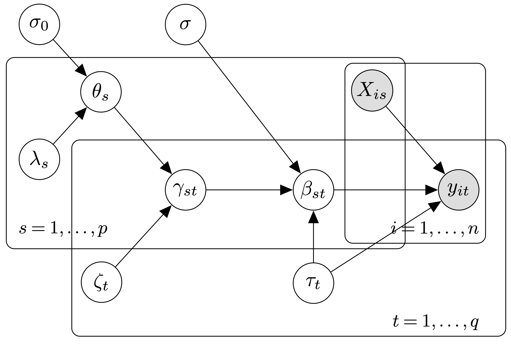

```{r setup, echo=FALSE}

# We first set the data, output and main directories for the analysis (please 
# edit according to your own setup):

rm(list = ls())

CORE_DIR <- file.path(Sys.getenv("CORE_DIR"), "software_corner_ibs_bulletin/")

data_dir <- file.path(CORE_DIR, "data/")
fig_dir <- file.path(CORE_DIR, "figures/")
out_dir <- file.path(CORE_DIR, "output/")
main_dir <- file.path(CORE_DIR, "scripts/")
setwd(main_dir)
```

Statistical studies aimed at identifying associations between a high-dimensional 
vector of candidate predictors and a collection of correlated outcomes have 
multiplied, prompted by the proliferation of technologies capable of measuring 
large volumes of information, whether on health and lifestyle parameters, 
molecular entities or even galaxies. As well as growing in dimension, the 
collected datasets are also growing in complexity, which calls for elaborate and 
flexible modelling approaches. When coupled with robust and efficient inference, 
Bayesian hierarchical modelling is a powerful framework for describing intricate 
dependencies at the scale required by current applications, while conveying 
uncertainty in a coherent fashion. In this note, we present the R package 
`atlasqtl`, which implements a scalable hierarchical framework for variable 
selection in regression problems with high-dimensional predictor and response 
spaces.


### Model and inference 

The model consists of a series of hierarchically-related spike-and-slab 
regressions that permit borrowing information across $q$ responses $y_t$, 
$t = 1, \ldots, q$, while also accounting for $p$ candidate predictors $X_s$, 
$s = 1, \ldots, p$, where both $p$ and $q$ may be larger than the number of 
samples $n$. Specifically, to each pair of predictor and response corresponds a 
regression coefficient $\beta_{st}$ and a spike-and-slab binary latent variable 
$\gamma_{st}$ from which posterior probabilities of association, 
\mbox{$\text{pr}(\gamma_{st} = 1 \mid y)$}, can employed for selection. The 
model is also tailored to the detection of \emph{hotspots}, namely, predictors 
associated with multiple responses: the top-level hierarchy entails a probit 
submodel which involves a response-specific contribution to the spike-and-slab 
probability of association, via $\zeta_t$, and a predictor-specific modulation 
of this contribution, via $\theta_s$. The latter parameter also acts as the 
propensity of predictor $X_s$ to be a hotspot and is assigned a horseshoe prior 
--- the corresponding global-local specification adapts to the overall problem 
sparsity (thanks to the global scale $\sigma_0$), while flexibly capturing the 
individual hotspot effects (thanks to the Cauchy tail of the local scale 
$\lambda_s$). A graphical representation of the model is provided in Figure 
\@ref(fig:figgm) and its full specification is given in @ruffieux2020global.

Joint inference requires special attention as the binary latent matrix 
$\Gamma = \{\gamma_{st}\}$ creates a discrete search space of dimension 
$2^{p\times q}$. To overcome this complication, `atlasqtl` relies on variational 
inference with a structured mean-field factorisation and efficient batch 
updates. The algorithm is augmented with a simulated annealing scheme that 
improves the exploration of multimodal spaces by introducing a so-called 
"temperature" parameter controlling the degree of separation of the modes for a 
series of "heated" distributions (@ruffieux2020global). 

`atlasqtl` can be employed in any sparse multiple-response regression setting 
with Gaussian errors. Hereafter we discuss a use case in the context of 
molecular quantitative trait locus (QTL) analysis, in which 
\emph{hotspot genetic variants}, controlling many molecular traits at once, may 
be responsible for important functional mechanisms underlying specific 
disease endpoints --- such studies aim to clarify the genetic architecture of 
diseases by estimating associations between several thousand responses 
(the molecular traits, e.g., genomic, proteomic, metabolomic levels) and up to a 
few million candidate predictors (the genetic variants). We have previously 
shown that accounting jointly for all traits and genetic variants with 
`atlasqtl` substantially improves the detection of weak association effects over 
more conventional marginal screening approaches (@ruffieux2020global).

```{r figgm, echo=FALSE, fig.cap="Graphical representation of the model with $n$ samples, $p$ candidate predictors and $q$ responses. The shaded nodes are observed, the others are inferred.", fig.align = 'center', out.width="90%"}

```


### Installation

The `atlasqtl` package is written in R with C++ subroutines. It can be installed 
from GitHub\footnote{\url{https://github.com/hruffieux/atlasqtl}} following the
instructions provided.


### Data and reproducibility

```{r data, echo=FALSE, results='hide'}

# The B-cell expression data and genetic variants are loaded (see `"Data and 
# reproducibility" Section above for details).
load(file.path(data_dir, "prepared_data.RData"))
ls()

p <- ncol(X)
q <- ncol(Y)
n <- nrow(X)

p # number of genetic variants (candidate predictors)
q # number of gene expression levels (traits)
n # sample size

bool_save <- FALSE # when TRUE, the analysis output is saved to a dedicated 
                   # directory and the output and error messages are redirected 
                   # to text files there.

if( bool_save ){
  res_dir <- paste0(out_dir, "atlasqtl_case_study/")
  dir.create(res_dir, showWarnings = FALSE)

  sink(paste(res_dir, "out.txt", sep = ""), append = FALSE, split = TRUE, 
       type = "output")
  sink(file(paste(res_dir, "err.txt", sep = ""), open = "wt"),
       type = "message")
}
```

The Rmarkdown document and data used to generate this note are publicly 
available for 
replication\footnote{\url{https://github.com/hruffieux/software_corner_ibs_bulletin}}. 
We restrict our illustration to the analysis of a small semi-synthetic dataset: 
it involves $q = 875$ traits capturing B-cell gene expression for $n = 100$ 
individuals ($n \times q$ matrix `Y`), and $p = 200$ candidate predictors 
generated with our in-house package `echoseq`\footnote{\url{https://github.com/hruffieux/echoseq}} 
to emulate real genetic variants ($n\times p$ matrix `X`). A subset of the 
traits was modified so as to be associated with five hotspot predictors; these 
hotspots control `r paste0(sort(rowSums(pat)[rowSums(pat)>0]), collapse = ", ")` 
genes, respectively.


### Illustration: joint expression QTL analysis in B cells

The following code chunk runs `atlasqtl` jointly on all the candidate predictors 
and traits, using a default geometric schedule on the inverse temperature, with 
initial temperature of $2$ and a grid of $10$ temperatures.

\footnotesize
```{r atlasqtl-load, include = TRUE, cache = FALSE, message=FALSE}
require(atlasqtl)
```

```{r atlasqtl-run, include = TRUE, cache = TRUE, results = "hide"}

mu_t <- 1; v_t <- 4 # hyperparameter specification

obj_atlasqtl <- atlasqtl(Y = Y, X = X, p0 = c(mu_t, v_t), 
                         add_collinear_back = TRUE, 
                         user_seed = 1)
```
\normalsize 

The analysis took less than $10$ seconds on a standard 
laptop\footnote{$2.8$ GHz Quad-Core Intel Core i7 machine (serial execution)}.

`atlasqtl` requires the specification of just two hyperparameters via the 
elicitation of a prior mean `mu_t` and variance `v_t` for the number of 
predictors associated with each response. The sensitivity of inference to these 
choices should be evaluated on a case-by-case basis; it is however low when a 
permutation-based Bayesian false discovery rate (FDR) threshold is employed, 
where the "null-case" permutation runs use the same hyperparameter 
specifications. The remaining model parameters are inferred by variational 
inference. In particular, the horseshoe prior on the hotspot propensity 
circumvents \emph{ad-hoc} choices of top-level variance parameters (for which 
inference is prone to spurious effects). This specification also has desirable 
multiplicity adjustment properties in large-response settings, see 
@ruffieux2020global. The argument `add_collinear_back` is a boolean indicating 
whether or not to include the final posterior summary for all possible collinear 
variables in `X` (which are removed during the run to ensure the stability of 
inference). The user can control additional settings --- e.g., the annealing 
schedule, seed for random number generation, convergence tolerance threshold, 
checkpointing --- as detailed on the help page of the function, which can be 
accessed by running `?atlasqtl` in the console. 

Custom S3 functions are also available. For instance the `print.atlasqtl` 
function provides basic information about the run:
\footnotesize
```{r S3-print, include = TRUE}
obj_atlasqtl
```
\normalsize 

The object `obj_atlasqtl` returned by `atlasqtl` contains posterior quantities 
that can be employed to assess:

   * pairwise associations between each pair of predictor and response: using 
   the variational posterior probabilities of association (PPAs) stored in 
   `gam_vb` ($p \times q$ matrix) and the variational posterior means of the 
   regression estimates stored in `beta_vb` ($p \times q$ matrix);
   * hotspot propensities: using the variational posterior mean of $\theta_s$ 
stored in `theta_vb` (vector of length $p$).

The `summary.atlasqtl` function displays a variable selection summary, which can 
be based on a supplied Bayesian FDR threshold (here $5\%$):

\footnotesize
```{r S3-summary, include = TRUE}
thres_fdr <- 0.05
summary(obj_atlasqtl, thres = thres_fdr, 
        fdr_adjust = TRUE, full_summary = FALSE)
```

\normalsize 
The user can also directly access the $p \times q$ matrix of FDR estimates for 
all predictor-response associations, using the function `assign_bFDR`. 
Alternatively, the scalablility of `atlasqtl` permits efficient 
permutation-based FDR estimation (see @ruffieux2017efficient or 
@ruffieux2020global).

Finally, the `plot.atlasqtl` function displays a Manhattan-type plot 
(Figure \@ref(fig:S3-plot)) with the hotspot positions and sizes after Bayesian 
FDR control: 
\footnotesize
```{r S3-plot, include = TRUE, fig.align = 'center', fig.cap="Hotspot sizes, as obtained using the S3 function plot.atlasqtl. The crosses indicate the simulated sizes of the five hotspots.", fig.align = 'center', out.width="90%"}
sim_hs <- rowSums(pat) # simulated hotspot sizes (5 hotspots)
                       # pat is a p x q binary 'pattern matrix' 
                       # locating the simulated associations
plot(obj_atlasqtl, thres = thres_fdr, fdr_adjust = TRUE, 
     ylim_max = max(sim_hs))
points(which(sim_hs>0), sim_hs[sim_hs>0], pch = "x")
```
\normalsize 


```{r output-save, echo = FALSE}
if (bool_save) { # if `bool_save = TRUE`, the full output is saved in the 
                 # directory created above.
  save(obj_atlasqtl, file = paste(res_dir, "output.RData", sep = "")) 
}
```


### Encoding predictor-level information

We recently proposed a new approach, called `epispot`, which extends the 
`atlasqtl` hierarchical framework to leverage information on the probability of 
candidate predictors to be involved in associations (@ruffieux2021epispot). 
Specifically, the effect of a (possibly high-dimensional) predictor-level vector 
of covariates is estimated using a secondary spike-and-slab regression at the 
top of the model hierarchy. The R package is available on 
GitHub\footnote{\url{https://github.com/hruffieux/epispot}}.

```{r session-info, echo = FALSE, results='hide'}
sessionInfo() # for reproducibility
```

\small
### References
